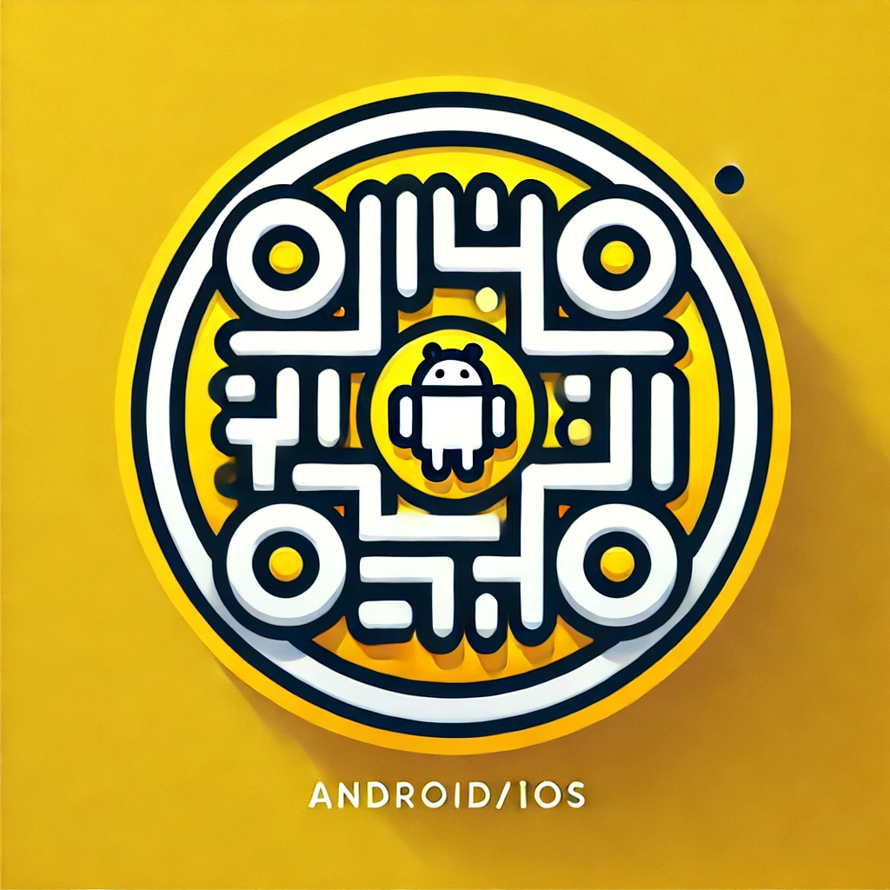

<head>
  <link rel="stylesheet" href="/../assets/css/styles.css">
</head>

# **First TMS 操作手冊**

  

* **版本 :** 1.0
* **公司名稱 :** 宏泰天一 Supply First

# **目錄**
1. [簡介](#簡介)
2. [安裝指南](#安裝指南)
3. [主要應用模塊](#主要應用模塊)

--- 

## **簡介**

Wallace

---

## **安裝指南**
<!-- 
| **Platform**    | **QR Code**           |
|-------------|--------------------|
| iOS         |  |
| Android     |  | -->

<table>
  <tr>
    <th style="background-color: #F5F5DC;">Platform</th>
    <th style="background-color: #F5F5DC;">QR Code</th>
  </tr>
  <tr>
    <td style="background-color: #FFEBEE;">iOS</td>
    <td style="background-color: #FFEBEE;">
      
    </td>
  </tr>
  <tr>
    <td style="background-color: #E3F2FD;">Android</td>
    <td style="background-color: #E3F2FD;">
      
    </td>
  </tr>
</table>

## **主要應用模塊**

  

